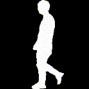
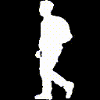
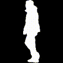

<div align="center"></div>

------------------------------------------
<!-- 📣📣📣 **[*GaitLU-1M*](https://ieeexplore.ieee.org/document/10242019) relseased, pls checking the [tutorial](datasets/GaitLU-1M/README.md).** 📣📣📣
📣📣📣 **[*SUSTech1K*](https://lidargait.github.io) relseased, pls checking the [tutorial](datasets/SUSTech1K/README.md).** 📣📣📣

🎉🎉🎉 **[*OpenGait*](https://openaccess.thecvf.com/content/CVPR2023/papers/Fan_OpenGait_Revisiting_Gait_Recognition_Towards_Better_Practicality_CVPR_2023_paper.pdf) has been accpected by CVPR2023 as a highlight paper！** 🎉🎉🎉 -->

OpenGait is a flexible and extensible gait recognition project provided by the [Shiqi Yu Group](https://faculty.sustech.edu.cn/yusq/) and supported in part by [WATRIX.AI](http://www.watrix.ai). 
The corresponding [paper](https://openaccess.thecvf.com/content/CVPR2023/papers/Fan_OpenGait_Revisiting_Gait_Recognition_Towards_Better_Practicality_CVPR_2023_paper.pdf) has been accepted by CVPR2023 as a highlight paper. 

## What's New
- **[Mar 2024]** [Chao](https://chaofan996.github.io) gives a talk about 'Progress in Gait Recognition'. The [video](https://event.baai.ac.cn/activities/768) and [slides](https://github.com/ChaoFan996/ChaoFan996.github.io/blob/main/240315-Progress%20in%20Gait%20Recognition.pdf) are both available😊
- **[Mar 2024]** The code of [SkeletonGait++](https://arxiv.org/pdf/2311.13444.pdf) is released [here](opengait/modeling/models/skeletongait%2B%2B.py), and you can refer to [readme](configs/skeletongait) for details.
- **[Mar 2024]** [BigGait](https://arxiv.org/pdf/2402.19122.pdf) has been accepted to CVPR2024🎉 Congratulations to [Dingqiang](https://faculty.sustech.edu.cn/?p=161709&tagid=yusq&cat=2&iscss=1&snapid=1&go=1&orderby=date)! This is his FIRST paper!
- **[Jan 2024]** The code of transfomer-based [SwinGait](https://arxiv.org/pdf/2303.03301.pdf) is available at [here](opengait/modeling/models/swingait.py).
- **[Dec 2023]** A new state-of-the-art baseline, i.e., [DeepGaitV2](https://arxiv.org/pdf/2303.03301.pdf), is available at [here](opengait/modeling/models/deepgaitv2.py)! 
- [Nov 2023] The first million-level unlabeled gait dataset, i.e., [GaitLU-1M](https://ieeexplore.ieee.org/document/10242019), is released and supported in [datasets/GaitLU-1M](datasets/GaitLU-1M/README.md).
- [Oct 2023] Several representative pose-based methods are supported in [opengait/modeling/models](./opengait/modeling/models). This feature is mainly inherited from [FastPoseGait](https://github.com/BNU-IVC/FastPoseGait). Many thanks to the contributors😊.
- [July 2023] [CCPG](https://github.com/BNU-IVC/CCPG) is supported in [datasets/CCPG](./datasets/CCPG).
<!-- - - - [July 2023] [SUSTech1K](https://lidargait.github.io) is released and supported in [datasets/SUSTech1K](./datasets/SUSTech1K).
[May 2023] A real gait recognition system [All-in-One-Gait](https://github.com/jdyjjj/All-in-One-Gait) provided by [Dongyang Jin](https://github.com/jdyjjj) is available.
[Apr 2023] [CASIA-E](datasets/CASIA-E/README.md) is supported by OpenGait.
- [Feb 2023] [HID 2023 competition](https://hid2023.iapr-tc4.org/) is open, welcome to participate. Additionally, the tutorial for the competition has been updated in [datasets/HID/](./datasets/HID).
- [Dec 2022] Dataset [Gait3D](https://github.com/Gait3D/Gait3D-Benchmark) is supported in [datasets/Gait3D](./datasets/Gait3D).
- [Mar 2022] Dataset [GREW](https://www.grew-benchmark.org) is supported in [datasets/GREW](./datasets/GREW). -->

## Our Publications
- [**CVPR'24**] BigGait: Learning Gait Representation You Want by Large Vision Models. [*Paper*](https://arxiv.org/pdf/2402.19122.pdf), and *Code* (coming soon). 
- [**AAAI'24**] SkeletonGait++: Gait Recognition Using Skeleton Maps. [*Paper*](https://arxiv.org/pdf/2311.13444.pdf), and [*Code*](opengait/modeling/models/skeletongait%2B%2B.py).
- [**AAAI'24**] Cross-Covariate Gait Recognition: A Benchmark. [*Paper*](https://arxiv.org/pdf/2312.14404.pdf), [*Dataset*](https://github.com/ShinanZou/CCGR), and [*Code*](https://github.com/ShiqiYu/OpenGait/blob/master/opengait/modeling/models/deepgaitv2.py).
- [**Arxiv'23**] Exploring Deep Models for Practical Gait Recognition. [*Paper*](https://arxiv.org/pdf/2303.03301.pdf), [*DeepGaitV2*](https://github.com/ShiqiYu/OpenGait/blob/master/opengait/modeling/models/deepgaitv2.py), and [*SwinGait*](https://github.com/ShiqiYu/OpenGait/blob/master/opengait/modeling/models/swingait.py).
- [**PAMI'23**] Learning Gait Representation from Massive Unlabelled Walking Videos: A Benchmark, [*Paper*](https://ieeexplore.ieee.org/document/10242019), [*Dataset*](datasets/GaitLU-1M/README.md), and [*Code*](opengait/modeling/models/gaitssb.py).
- [**CVPR'23**] LidarGait: Benchmarking 3D Gait Recognition with Point Clouds, [*Paper*](https://openaccess.thecvf.com/content/CVPR2023/papers/Shen_LidarGait_Benchmarking_3D_Gait_Recognition_With_Point_Clouds_CVPR_2023_paper.pdf), [*Dataset*](https://lidargait.github.io) and [*Code*](datasets/SUSTech1K/README.md).
- [**CVPR'23**] OpenGait: Revisiting Gait Recognition Toward Better Practicality, [*Highlight Paper*](https://openaccess.thecvf.com/content/CVPR2023/papers/Fan_OpenGait_Revisiting_Gait_Recognition_Towards_Better_Practicality_CVPR_2023_paper.pdf), and [*Code*](configs/gaitbase).
- [**ECCV'22**] GaitEdge: Beyond Plain End-to-end Gait Recognition for Better Practicality, [*Paper*](), and [*Code*](configs/gaitedge/README.md).

## A Real Gait Recognition System: All-in-One-Gait
<div align="center">
       
</div>

The workflow of [All-in-One-Gait](https://github.com/jdyjjj/All-in-One-Gait) involves the processes of pedestrian tracking, segmentation and recognition.
See [here](https://github.com/jdyjjj/All-in-One-Gait) for details.

## Highlighted features
- **Multiple Dataset supported**: [CASIA-B](http://www.cbsr.ia.ac.cn/english/Gait%20Databases.asp), [OUMVLP](http://www.am.sanken.osaka-u.ac.jp/BiometricDB/GaitMVLP.html), [SUSTech1K](https://lidargait.github.io), [HID](http://hid2022.iapr-tc4.org/), [GREW](https://www.grew-benchmark.org), [Gait3D](https://github.com/Gait3D/Gait3D-Benchmark), [CCPG](https://openaccess.thecvf.com/content/CVPR2023/papers/Li_An_In-Depth_Exploration_of_Person_Re-Identification_and_Gait_Recognition_in_CVPR_2023_paper.pdf), [CASIA-E](https://www.scidb.cn/en/detail?dataSetId=57be0e918db743279baf44a38d013a06), and [GaitLU-1M](https://ieeexplore.ieee.org/document/10242019).
- **Multiple Models Support**: We reproduced several SOTA methods and reached the same or even better performance. 
- **DDP Support**: The officially recommended [`Distributed Data Parallel (DDP)`](https://pytorch.org/tutorials/intermediate/ddp_tutorial.html) mode is used during both the training and testing phases.
- **AMP Support**: The [`Auto Mixed Precision (AMP)`](https://pytorch.org/tutorials/recipes/recipes/amp_recipe.html?highlight=amp) option is available.
- **Nice log**: We use [`tensorboard`](https://pytorch.org/docs/stable/tensorboard.html) and `logging` to log everything, which looks pretty.

## Getting Started


Please see [0.get_started.md](docs/0.get_started.md). We also provide the following tutorials for your reference:
- [Prepare dataset](docs/2.prepare_dataset.md)
- [Detailed configuration](docs/3.detailed_config.md)
- [Customize model](docs/4.how_to_create_your_model.md)
- [Advanced usages](docs/5.advanced_usages.md) 

## Model Zoo

[](https://huggingface.co/opengait/OpenGait/)

Results of appearance-based gait recognition are available [here](docs/1.model_zoo.md).

Results of pose-based gait recognition are available [here](./docs/1.1.skeleton_model_zoo.md).


## Authors:
**OpenGait Team (OGT)**

- [Chao Fan (樊超)](https://chaofan996.github.io), 12131100@mail.sustech.edu.cn
- [Chuanfu Shen (沈川福)](https://chuanfushen.github.io), 11950016@mail.sustech.edu.cn
- [Junhao Liang (梁峻豪)](https://faculty.sustech.edu.cn/?p=95401&tagid=yusq&cat=2&iscss=1&snapid=1&orderby=date), 12132342@mail.sustech.edu.cn

## Acknowledgement
- GLN: [Saihui Hou (侯赛辉)](http://home.ustc.edu.cn/~saihui/index_english.html)
- GaitGL: [Beibei Lin (林贝贝)](https://scholar.google.com/citations?user=KyvHam4AAAAJ&hl=en&oi=ao)
- GREW: [GREW TEAM](https://www.grew-benchmark.org)

- FastPoseGait Team: [FastPoseGait Team](https://github.com/BNU-IVC/FastPoseGait)

- Gait3D Team: [Gait3D Team](https://gait3d.github.io/)

## Citation

```
@InProceedings{Fan_2023_CVPR,
    author    = {Fan, Chao and Liang, Junhao and Shen, Chuanfu and Hou, Saihui and Huang, Yongzhen and Yu, Shiqi},
    title     = {OpenGait: Revisiting Gait Recognition Towards Better Practicality},
    booktitle = {Proceedings of the IEEE/CVF Conference on Computer Vision and Pattern Recognition (CVPR)},
    month     = {June},
    year      = {2023},
    pages     = {9707-9716}
}
```

**Note:**
This code is only used for **academic purposes**, people cannot use this code for anything that might be considered commercial use.
