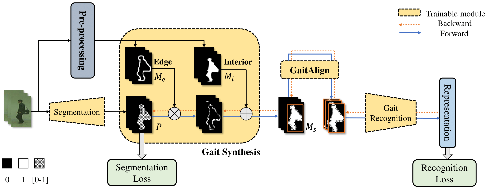

# GaitEdge: Beyond Plain End-to-end Gait Recognition for Better Practicality

This [paper](https://arxiv.org/abs/2203.03972) has been accepted by ECCV 2022, the source code and CASIA-B* dataset mentioned in the paper will be released within two weeks.

## Abstract
Gait is one of the most promising biometrics to identify individuals at a long distance. Although most previous methods have focused on recognizing the silhouettes, several end-to-end methods that extract gait features directly from RGB images perform better. However, we argue that these end-to-end methods inevitably suffer from the gait-unrelated noises, i.e., low-level texture and colorful information. Experimentally, we design both the cross-domain evaluation and visualization to stand for this view. In this work, we propose a novel end-to-end framework named GaitEdge which can effectively block gait-unrelated information and release end-to-end training potential. Specifically, GaitEdge synthesizes the output of the pedestrian segmentation network and then feeds it to the subsequent recognition network, where the synthetic silhouettes consist of trainable edges of bodies and fixed interiors to limit the information that the recognition network receives. Besides, GaitAlign for aligning silhouettes is embedded into the GaitEdge without loss of differentiability. Experimental results on CASIA-B and our newly built TTG-200 indicate that GaitEdge significantly outperforms the previous methods and provides a more practical end-to-end paradigm for blocking RGB noises effectively.

