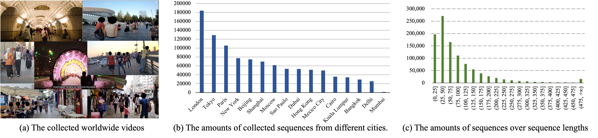

# GaitLU-1M

GaitLU-1M represents the first large-scale unlabelled gait dataset. It consists of over one million walking sequences averaging 92 frames, namely over 92M silhouette images.

GaitLU-1M is extracted from public videos shot around the world, making it cover a wide range of variations, involving the capturing scenes (streets, subway and airport, etc.), individual attributes (gender, age and race, etc.), photography conditions (camera view, resolution, illumination and weather, etc.), and so on. 

This great diversity and scale offer an excellent chance to learn general gait representation in a self-supervised manner.

## Download
### Step1: 
Download the dataset from [Baidu Yun](https://pan.baidu.com/s/1aexoZY-deZFXSuyfOOjwJg) (code: 4rat) or 
[Google Drive](https://drive.google.com/drive/folders/12tVpohZ6J6u42kOKR6S2p5m07QKr_Dt-).

There are 6 sub-zip files and you can aggregate them by:
```shell
zip -F GaitLU_Anno_part.zip --out GaitLU_Anno.zip
``` 

### Step2: 
Then, you can decompress the file by:
```shell
unzip -P password GaitLU_Anno.zip -d <output_folder>
```
To obtain the password, you should sign the [Release Agreement](./Release_Agreement.pdf) and [Ethical Requirement](./Ethical_Requirements.pdf) and send the signed documents to our administrator (12131100@mail.sustech.edu.cn). 

Finally, you can get GaitLU-1M formatted as: 
```
silhouette_cut_pkl
├── 000                           # Random number
│   ├── 000                       # Random number
│   │   ├── 000                   # Random number
│   │   │   ├── 000_000_000.pkl   # Silhouette sequence
                ......
            ......
        ......
    ......
```


## Usage
For the training phase, you should modify the `dataset_root` in `configs/gaitssb/pretrain.yaml` and run the following command:
```shell
CUDA_VISIBLE_DEVICES=0,1,2,3 python -m torch.distributed.launch --nproc_per_node=4 opengait/main.py --cfgs configs/gaitssb/pretrain.yaml --phase train --log_to_file
```
The officially provided pretrained checkpoint can be found [here]() (Coming soon). 

Then you can evaluate the pretrained model on labelled gait datasets by runing: 
```shell
CUDA_VISIBLE_DEVICES=0,1,2,3 python -m torch.distributed.launch --nproc_per_node=4 opengait/main.py --cfgs ./configs/gaitssb/pretrain_test_on_gait3d.yaml --phase test --iter 150000
CUDA_VISIBLE_DEVICES=0,1,2,3 python -m torch.distributed.launch --nproc_per_node=4 opengait/main.py --cfgs ./configs/gaitssb/pretrain_test_on_grew.yaml --phase test --iter 150000
CUDA_VISIBLE_DEVICES=0,1,2,3 python -m torch.distributed.launch --nproc_per_node=4 opengait/main.py --cfgs ./configs/gaitssb/pretrain_test_on_casiab.yaml --phase test --iter 150000
CUDA_VISIBLE_DEVICES=0,1,2,3 python -m torch.distributed.launch --nproc_per_node=4 opengait/main.py --cfgs ./configs/gaitssb/pretrain_test_on_oumvlp.yaml --phase test --iter 150000
```

For the fine-tuning purpose, the configs displayed [here](../../configs/gaitssb/) may help you. 

## Citation
If you use this dataset in your research, please cite the following paper:
```
@ARTICLE{10242019,
  author={Fan, Chao and Hou, Saihui and Wang, Jilong and Huang, Yongzhen and Yu, Shiqi},
  journal={IEEE Transactions on Pattern Analysis and Machine Intelligence}, 
  title={Learning Gait Representation From Massive Unlabelled Walking Videos: A Benchmark}, 
  year={2023},
  volume={45},
  number={12},
  pages={14920-14937},
  doi={10.1109/TPAMI.2023.3312419}
}
```
If you think OpenGait is useful, please cite the following paper:
```
@InProceedings{Fan_2023_CVPR,
    author    = {Fan, Chao and Liang, Junhao and Shen, Chuanfu and Hou, Saihui and Huang, Yongzhen and Yu, Shiqi},
    title     = {OpenGait: Revisiting Gait Recognition Towards Better Practicality},
    booktitle = {Proceedings of the IEEE/CVF Conference on Computer Vision and Pattern Recognition (CVPR)},
    month     = {June},
    year      = {2023},
    pages     = {9707-9716}
}
```
