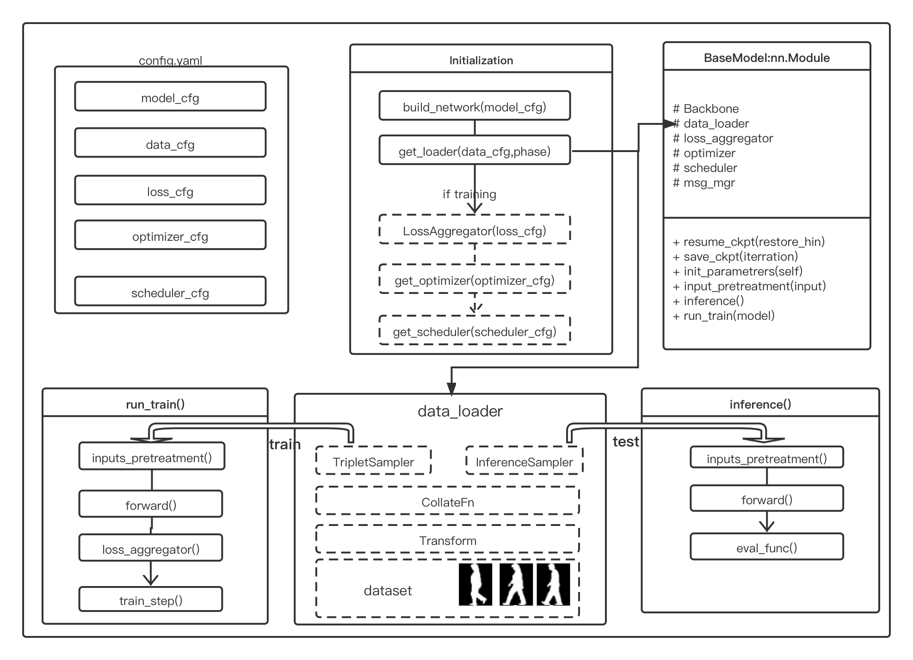

# How to Create Your Own Model
## Pipeline


## A new model
If you want to design a new model, you need to write a class inherited from `BaseModel`, e.g, NewModel in newmodel.py:
```python
from ..base_model import BaseModel

class NewModel(BaseModel):
    def __init__(self, cfgs, is_training):
        super().__init__(cfgs, is_training)

    def build_network(self, model_cfg):
        self.encoder = ...

    def forward(self, inputs):
        ipts, labs, typs, viws, seqL = inputs
        sils = ipts[0]
        if len(sils.size()) == 4:
            sils = sils.unsqueeze(2)
        del ipts
        n, s, c, h, w = sils.size()

        embed_1, logits, embed = self.encoder(sils)

        return {
            'training_feat': {
                'triplet': {'embeddings': embed_1, 'labels': labs},
                'softmax': {'logits': logits, 'labels': labs}
            },
            'visual_summary': {
                'image/sils': sils.view(n*s, 1, h, w)
            },
            'inference_feat': {
                'embeddings': embed
            }
        }

```
 In your model class, at least you need to implement `build_network()` and `forward()` functions. The first is used to build the netwroks, and it does not need `return value`. Another is used to calculate the features, the `return value` is fixed in dictionary format

> `training_feat` is for the loss computing, and it must be a `dict` object. 
> 
> `visual_summary` is for visualization, and it must be a `dict` object. 
> 
> `inference_feat` is for the inference, and it must be a `dict` object. 
> 
> `triplet` and `softmax` are the prefixes (or names) of the loss function.
> 
> `embeddings`, `logits` and `labels` are the input arguments of the loss function.

More information should be seen in [base_model.py](../opengait/modeling/base_model.py) and [loss_aggregator.py](../opengait/modeling/loss_aggregator.py).

After finishing the model file, you have two steps left to do:

**Step 1**: Put your newmodel.py under `opengait/modeling/models`.

**Step 2**: Specify the model name in a yaml file:
```yaml
model_cfg:
  model: NewModel
  param1: ...
  param2: ...
  param3: ...
```


## A new loss
If you want to write a new loss, you need to write a class inherited from `opengait/modeling/losses`, like this
```python
from .base import BaseLoss

class NewLoss(BaseLoss):
    def __init__(self, *args, **kwargs):
        super(NewLoss, self).__init__(*args, **kargs)

    @gather_and_scale_wrapper
    def forward(self, embeddings, labels):
        pass
```
Remember to use `gather_and_scale_wrapper` to wrap your forward function if your loss is computed by pairs like `triplet`. By this, we gather all features to one GPU card and scale the loss by the number of GPUs.

Then, put your loss in `opengait/modeling/losses` so that you can use it in config file. 

Moreover, refer to [loss_aggregator.py](../opengait/modeling/loss_aggregator.py) to explore how does your defined loss work in the model.
